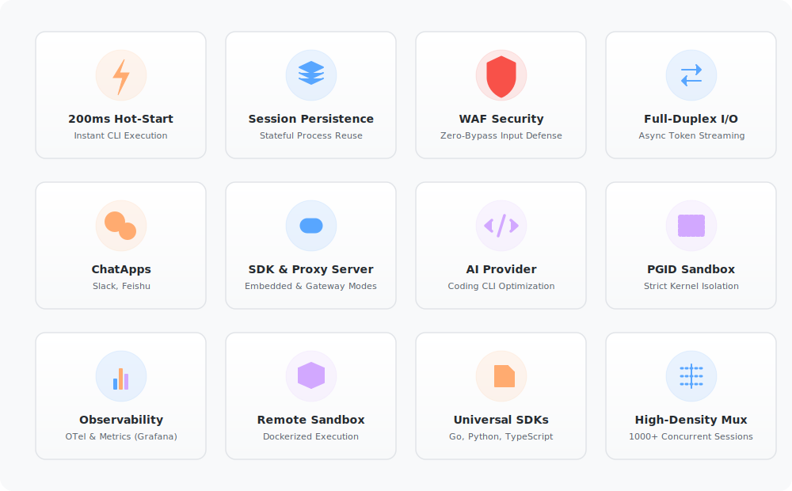

<div align="center">
  
  <h1>hotplex</h1>
  <p><b>将顶尖 AI CLI 智能体转化为“生产就绪”交互服务的执行基座</b></p>
  <p><i>打破一次性 CLI 任务的局限，通过全双工、可追加指令的有状态模式，实现毫秒级交互、安全隔离与极简系统集成。</i></p>

  <p>
    <a href="https://github.com/hrygo/hotplex/releases"></a>
    <a href="https://goreportcard.com/report/github.com/hrygo/hotplex"></a>
    <a href="LICENSE"></a>
  </p>
  <p>
    <a href="README.md">English</a> • <b>简体中文</b> • <a href="docs/sdk-guide_zh.md">开发者手册</a> • <a href="docs/webapps/slack-setup-beginner_zh.md">Slack 接入保姆级教程</a> • <a href="https://hrygo.github.io/hotplex/">文档站点</a>
  </p>
</div>

<br/>

## ⚡ 什么是 hotplex？

**hotplex** 不仅仅是一个进程复用器，它是 AI 智能体工程化集成的**“超级适配桥梁”**。

我们的**第一性原理**是：**将原本为“人类终端”设计的 AI CLI 工具（如 Claude Code, OpenCode），升级为“面向系统指令”的长生命周期交互服务（Cli-as-a-Service）。**

开发者不再需要为 Headless 模式下频繁重启 CLI 带来的数秒延迟而苦恼，也不必从零构建复杂的 Agent 环境。hotplex 通过在后台维护持久化的、全双工的会话池，彻底消灭了冷启动带来的交互断层，让 Agent 的集成像调用普通 API 一样简单、连贯且安全。

<div align="center">
  
</div>

### 为什么选择 hotplex？
- 🔄 **Cli-as-a-Service**：打破“运行即收摊”的局限，支持同一进程内持续追加指令，保持上下文状态。
- 🧩 **极简便利集成**：提供统一的 Go SDK 与协议网关，让顶级智能体能力瞬间接入你的现有产品。
- 🚀 **消除等待代价**：彻底屏蔽 Node.js/Python 运行时漫长的启动耗时，提供亚秒级的丝滑反馈。
- 🛡️ **快且相对安全**：内置指令级 WAF 与 PGID 隔离，为 AI 在 Shell 中的各种操作戴上“防护手套”。
- 💬 **ChatApps 集成**：将 HotPlex 连接到 **Slack**（原生 Block Kit、流式输出、Assistant Status API）和 **钉钉**等平台，直接在团队工作区中进行 AI 协作。
- 🔌 **全场景兼容**：无论是原生 Go 嵌入还是独立代理服务器，均支持 WebSocket 与 OpenCode 兼容协议。

---

## 🚀 快速开始

### 推荐：ChatApps 平台接入 (Slack、Telegram、飞书、钉钉等)

生产环境的**主要接入方式**。通过即时通讯平台直接与 AI 智能体对话。

> 🌈 **Slack 新手通道**：不想看复杂设置？👉 **[点击这里查看 Slack 零基础保姆级接入教程](docs/webapps/slack-setup-beginner_zh.md)**，图文并茂、5 分钟搞定！

| 平台         | 状态                                           |
| ------------ | ---------------------------------------------- |
| **Slack**    | ✅ 稳定 - Block Kit、流式输出、Assistant Status |
| **Telegram** | ✅ 稳定                                         |
| **飞书**     | ✅ 稳定                                         |
| **钉钉**     | ✅ 稳定                                         |

**分钟级快速启动：**
```bash
# 1. 使用 --config 参数指定配置目录（推荐，优先级最高）
hotplexd --config chatapps/configs

# 2. 或使用环境变量
export HOTPLEX_CHATAPPS_ENABLED=true
export HOTPLEX_CHATAPPS_CONFIG_DIR=chatapps/configs
hotplexd
```

→ **[完整 ChatApps 接入指南](docs/quick-start_zh.md)** - 各平台分步教程

---

### 备选：Go SDK 或独立服务端

适用于自定义集成或微服务架构。

| 方式           | 适用场景                     |
| -------------- | ---------------------------- |
| **Go SDK**     | 嵌入式集成、零开销           |
| **独立服务端** | 多语言客户端、WebSocket 连接 |

**快速示例 (Go SDK)：**
```bash
go get github.com/hrygo/hotplex
```

```go
engine, _ := hotplex.NewEngine(hotplex.EngineOptions{Timeout: 5 * time.Minute})
engine.Execute(ctx, cfg, "你的指令", callback)
```

→ **[完整 SDK 接入指南](docs/quick-start_zh.md#选项-2go-sdk)** 查看详细文档

---

## 🏗️ 架构设计

hotplex 实现了 **接入层（Access Layer）** 与 **引擎执行层（Engine Layer）** 的彻底解耦，它利用有限容量的 Go Channel (管道) 和 WaitGroup 机制，大规模场景下依然能够保证确定性且安全的并发 I/O 处理。

### 1. 系统拓扑图
<div align="center">
  
</div>

- **接入层 (Access Layer)**：支持原生的 Go SDK 本地调用，或者远程的 API 接口请求 (`hotplexd`)。包含专用的 **OpenCode HTTP/SSE 兼容性处理器**。
- **引擎层 (Engine Layer)**：以单例模式管理资源管理器、会话池分配、配置属性覆盖以及核心安全 WAF。
- **进程层 (OS Process Layer)**：实际工作的子进程，位于 PGID 级别的隔离工作区内，并被严格锁定在指定的目录边界中工作。

### 2. 全双工异步事件流
<div align="center">
  
</div>

不同于标准 RPC 或 REST 的“请求-响应”循环模式，hotplex 深度接入 Go 的非阻塞并发模型中。`stdin`、`stdout` 和 `stderr` 在客户端和服务端子进程之间进行持续的双向管道通信，确保本地 LLM 工具能够以亚秒级的速度输出令牌（Token）。

---

## 📖 详细文档

### 核心技术手册
- **[ChatApps 手册](chatapps/README.md)**：多平台连接器（Slack、钉钉、飞书等）与原生 Block Kit 支持及 AI 原生 UX 模式。
- **[Engine 手册](engine/README.md)**：核心控制面、进程热复用及执行逻辑。
- **[Provider 手册](provider/README.md)**：AI 智能体抽象（Claude Code、OpenCode）与事件归一化。
- **[Internal 子系统](internal/README.md)**：底层安全 WAF、会话池管理及系统工具集。

### 指南与手册
- **[架构深度解析](docs/architecture_zh.md)**：深入了解内部工作原理、安全协议及会话管理逻辑。
- **[SDK 开发者手册](docs/sdk-guide_zh.md)**：将 HotPlex 集成到您的 Go 应用程序的完整指南。
- **[Slack 集成指南](docs-site/guide/chatapps-slack.md)**：全面指南，将 HotPlex 连接到 Slack 并使用原生流式输出。
- **[可观测性指南](docs/observability-guide_zh.md)**：OpenTelemetry 和 Prometheus 集成。
- **[Docker 部署](docs/docker-deployment_zh.md)**：容器和 Kubernetes 部署。
- **[生产环境指南](docs/production-guide_zh.md)**：生产环境部署最佳实践。

---

## 📂 示例代码库

浏览我们的即插即用示例，加速您的集成：

- **[go_claude_basic](_examples/go_claude_basic/main.go)**: 基础配置快速上手。
- **[go_claude_lifecycle](_examples/go_claude_lifecycle/main.go)**: Claude 多轮对话、会话恢复及 PGID 管理。
- **[go_opencode_basic](_examples/go_opencode_basic/main.go)**: OpenCode 极简集成示例。
- **[go_opencode_lifecycle](_examples/go_opencode_lifecycle/main.go)**: OpenCode 多轮对话及会话持久化示例。
- **[node_claude_websocket](_examples/node_claude_websocket/enterprise_client.js)**: 全双工 Web 客户端集成。

---

## 🛡️ 安全防御体系

CLI 智能体本质上是在直接执行 LLM 生成的 raw Shell 命令。**安全绝不能被当作事后的补救手段。** hotplex 采用了深度的防御策略体系：

| 保护层级                  | 实现方式                              | 防护能力                                                   |
| :------------------------ | :------------------------------------ | :--------------------------------------------------------- |
| **I. 工具能力控制**       | `AllowedTools` 安全放行名单           | 精准约束智能体内部可以操作使用的工具集范围                 |
| **II. 危险探测 WAF**      | 正则与字符串组合拦截分析              | 硬性拦截及阻断 `rm -rf /`、`mkfs`、`dd` 等破坏性宿主机指令 |
| **III. 操作系统进程隔离** | 基于进程组 ID (`PGID`) 派发 `SIGKILL` | 防止衍生的孤儿后台守护进程以及僵尸进程导致的泄漏           |
| **IV. 文件系统隔离沙箱**  | 工作目录 (`WorkDir`) 锁定限制         | 把智能体的视界及修改权限严格限制在给定的项目根目录中       |

<br/>

<div align="center">
  
</div>

---

## 💡 典型应用场景

| 领域                        | 具体应用                                                             | 核心收益                                                                |
| :-------------------------- | :------------------------------------------------------------------- | :---------------------------------------------------------------------- |
| 🌐 **面向 Web 的 AI 客户端** | 让用户能直接在浏览器内驱动并体验 "Claude Code" 级别的聊天窗工具。    | 完美保持了多次对话状态与会话上下文的持久留存。                          |
| 🔧 **DevOps 自动运维平台**   | 由 AI 自主驱动的 Bash 脚本生成及运行，现场分析 Kubernetes 运行日志。 | 通过远程云端控制极速执行，免去了每次都重新拉起 Node/Python 环境的耗时。 |
| 🚀 **CI/CD 深度集成智能**    | 代码提交智能审计、格式化自动修复，以及高危基础代码漏洞修复。         | 可一键无损对接到 GitHub Actions 或者 GitLab CI 流水线 Runner 节点中。   |
| 🕵️ **AIOps 日常排雷护航**    | 针对 Pods 节点进行故障排查，并在可控范围内使用 remediation 命令。    | 内置的安全正则 WAF 强效保障了 AI 绝不会酿成生产环境瘫痪。               |

---

## 🗺️ 未来线路规划

我们正积极演进 hotplex 引擎框架，使其成为未来本地 AI 工具生态中最值得信赖的核心执行引擎：

### 🚀 未来规划 (2026 下半旬)

- [ ] **持久化存储**：跨重启的会话状态持久化，实现真正的长生命周期智能体。
- [ ] **原生 LLM 大脑**：内置记忆与上下文管理，实现自主智能体行为。
- [ ] **L2/L3 面向系统级沙箱隔离**：整合 Linux Namespace (PID/Net) 和 WASM 形态容器。
- [ ] **增强 ChatApps**：扩展平台支持（Discord、Teams）并提供更丰富的 UI 组件。

---

## 🤝 参与项目建设

欢迎为本项目提交代码贡献！提出 PR 前请确保您的代码通过了所有流水线检查项。

```bash
# 验证代码格式规范（Lint）
make lint

# 运行单元测试并进行内存竞态检查（Race Check）
make test
```
关于架构规范与 PR 提交说明，详情请查阅 [CONTRIBUTING.md](CONTRIBUTING.md) 文件。

---

## 📄 许可协议

hotplex 开源采用 [MIT License](LICENSE) 许可协议发布。

<div align="center">
  <i>以 <b>❤️</b> 为 AI 工程化社区倾力构建。</i>
</div>
