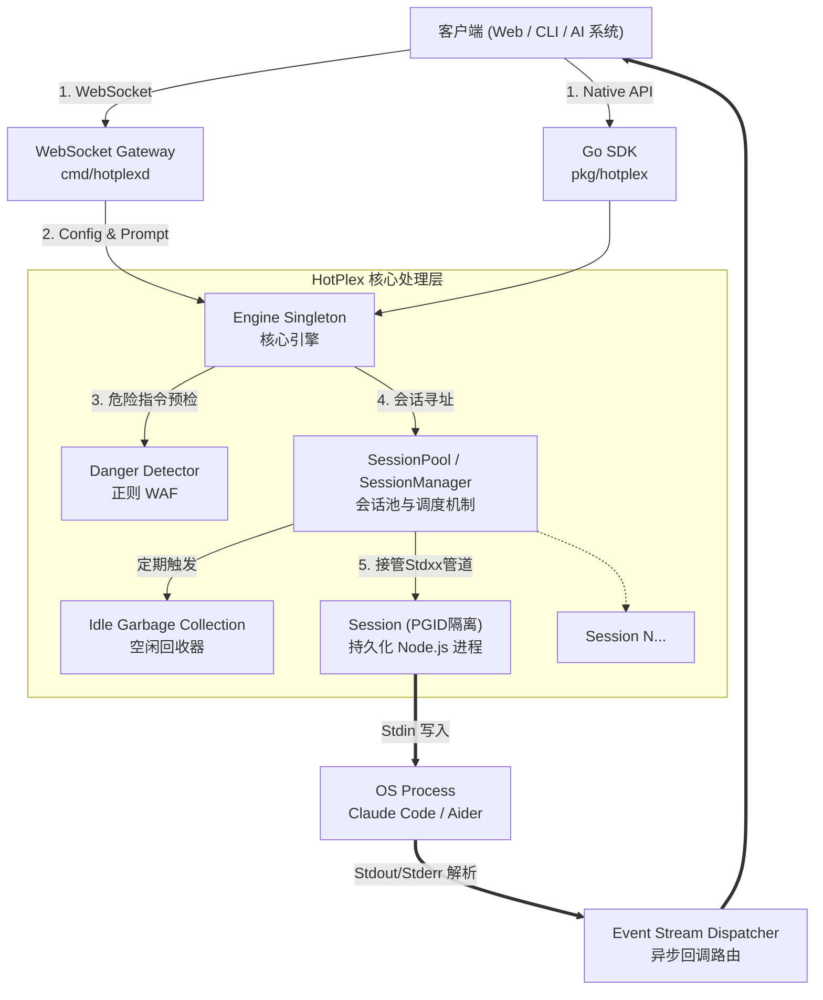
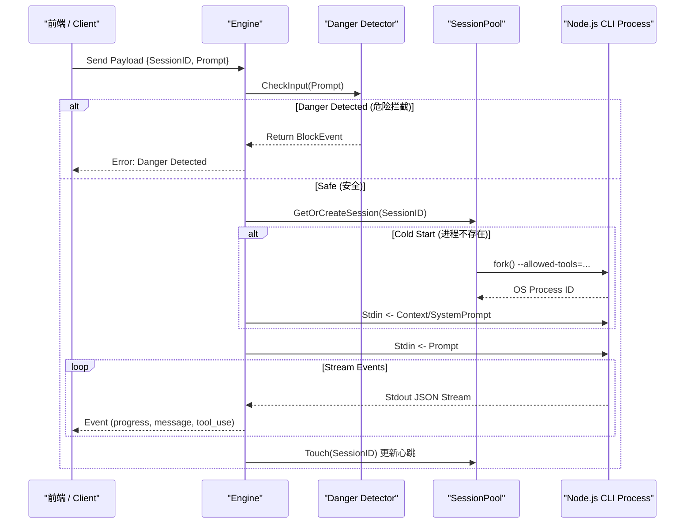

# HotPlex 核心架构设计文档

*查看其他语言: [English](architecture.md), [简体中文](architecture_zh.md).*

HotPlex 是一个高性能的进程多路复用器 (Process Multiplexer)，专为解决大模型 CLI 智能体（如 Claude Code, OpenCode）启动缓慢（冷启动）的问题而设计。它通过在后台维护持久化的进程池，实现毫秒级的指令响应与执行结果流式返回。

---

## 1. 架构概览 (Architecture Overview)

HotPlex 采用清晰的分层架构设计，确保核心引擎的纯净与外部接入的灵活性。系统整体分为 **接入层**、**引擎层**、**会话控制层** 与 **底层进程隔离层**。

---

## 2. 核心系统组件

### 2.1 接入层 (Gateway & SDK)
*   **WebSocket Gateway (`internal/server`, `cmd/hotplexd`)**: 提供开箱即用的网络服务器能力，允许跨语言（React/Vue 浏览器前端、Python 脚本等）通过无状态的 WebSocket 连接操控有状态的底层代理进程。 
*   **原生 Go SDK (`pkg/hotplex`)**: 允许将 HotPlex 作为嵌入式引擎直接集成到其他 Golang 编写的服务端模块中，进行内存级的高效协同。

### 2.2 引擎核心 (`hotplex.Engine`)
*   **全局生命周期管理者**: `Engine` 是单例模式的入口点。它负责对外的统一调用接口 (`Execute`, `StopSession`)。
*   **配置中心化 (EngineOptions)**: 
    从 v0.2.0 开始，所有的核心安全边界（如 `AllowedTools`, `DisallowedTools`）都由 `EngineOptions` 全局定义。这确保了沙箱规则在引擎初始化时即固化，防止通过单次 `Execute` 调用的 `Config` 进行沙箱逃逸。
*   **确定性会话路由 (Deterministic Namespace)**:
    在 API 设计上，系统使用基于 UUID v5 的确定性命名空间生成算法，将上层业务的 `ConversationID` 映射为持久的 `SessionID`，从而保证了相同对话请求永远路由到同一个活跃的 CLI 进程中。

### 2.3 会话控制与调度 (`hotplex.SessionPool` & `hotplex.Session`)
*   **热连结机制 (Hot-Multiplexing)**: `SessionPool` 基于并发安全的 Map 维护全局活跃进程表。对于新的 `SessionID` 执行**冷启动 (Cold Start)**；对于已存在的 `SessionID`，则跳过启动阶段，直接向 `Stdin` 投递增量指令（**热执行**）。
*   **空闲回收 (GC)**: 内部运行着独立的协程 `cleanupLoop`，对进程池进行定期巡检。超过预设 `IdleTimeout` 未活跃的进程将被回收，释放系统内存。
*   **异步流路由 (Asynchronous Stream Dispatch)**: `Session` 组件封装了 `bufio.Scanner` 来异步且非阻塞地读取 `Stdout/Stderr`，实时解析 JSON Stream 协议，并将不同类型的 Event 回调分派给客户端。

### 2.4 安全沙箱与能力限制 (Security Pivot)
HotPlex 的安全策略在 v0.2.0 经历了重大转向，从基于路径的拦截转向基于工具的能力限制：
1.  **原生工具约束 (Native Tool Constraints)**: 
    由于 HotPlex 封装的是成熟的 CLI 智能体（如 Claude Code），这些智能体自身提供了强大的工具治理能力。HotPlex 通过 `AllowedTools` / `DisallowedTools` 配置，在启动 CLI 时通过其原生参数（如 `--allowed-tools`）进行硬性约束。这比传统的路径拦截更可靠，因为它可以直接在语义层面阻止智能体调用特定的高危能力（如 `Bash` 或 `Edit`）。
2.  **危险指令正则 WAF (`Detector`)**:
    保留了基于正则的危险指令扫描，作为最后的防线。在指令落入 `Stdin` 前，自动抓取恶意的破坏性意图（如 `rm -rf /`），提供指令级的主动防御。
3.  **进程组隔离 (PGID Isolation)**: 
    为防止流氓智能体 Fork 出难以控制的子孙进程，`Session` 使用独占的 PGID。终止时对整个 `-PGID` 发送 `SIGKILL`，确保物理级的完全清理。
4.  **工作空间锁定**: 动态设定子进程的 `WorkDir`，配合 native 工具的沙箱能力，确保操作被严格限制在项目空间内。

---

## 3. 会话生命周期与数据流向阶段

## 4. 关键扩展演进方向 (Future Work)
- **多协议抽象 (Provider Interface)**: 引入 `Provider` 接口机制，向下对接 `OpenCode`, `Aider` 等不同协议的智能体。
- **远程容器隔离 (Remote Docker Sandbox)**: 将 `Session` 扩展为调用 Docker API 在完全隔离的容器环境内生成短时会话，替代本地 OS 进程。
- **可观测性面板**: 提供 REST API 实时监控会话池状态、Token 消耗统计及异常进程强制回收功能。
