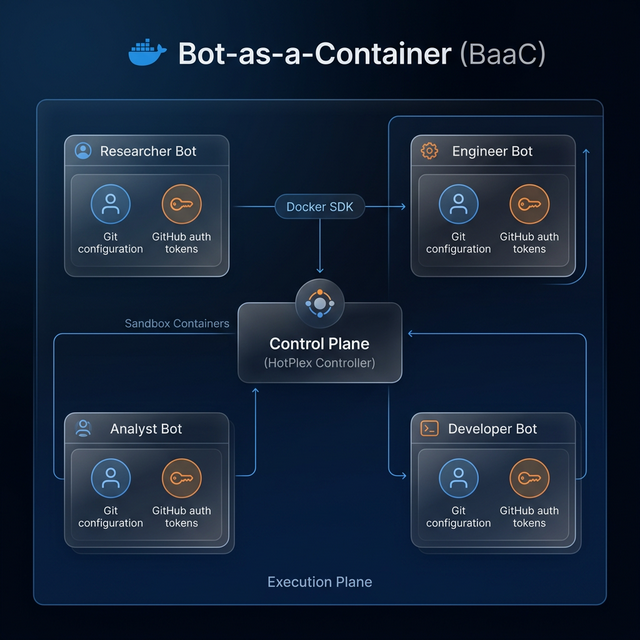
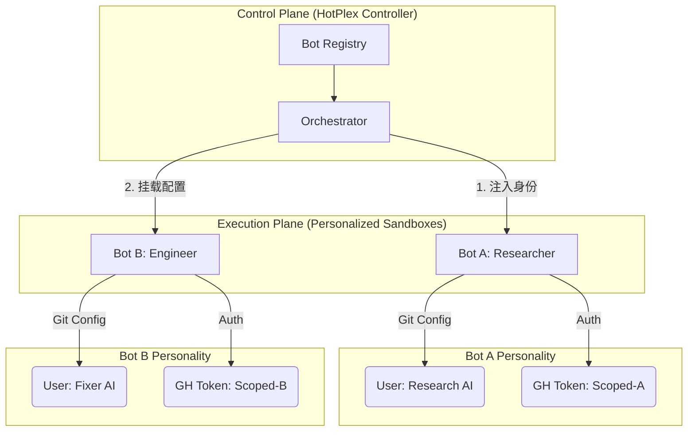

# HotPlex: "Bot-as-a-Container" (BaaC) Native Architecture Plan

> **Revision**: 3.1 | **Date**: 2026-03-06 | **Theme**: Zero-Config, Personality-Aware, High-Capability Sandbox

## 1. 核心痛点与架构演进 (Motivation)

目前 HotPlex 采用的是 **进程级多租户模式**。虽然在 Docker 内运行，但所有 Bot 共享同一个容器环境及同一份 Git/GH 配置，导致身份隔离薄弱且配置冲突。

**新目标**：实现 **“千机千面”的容器化 Bot**。每个 Bot 不仅运行在物理隔离的沙箱中，还拥有独立的 Git 身份、GitHub CLI 凭证及个性化工具链，实现在保护安全的同时，充分释放 Bot 的 AI 能力。

---

## 2. 核心架构：控制面与持久化个性化执行面





---

## 3. 深度定制化与安全特性

### 3.1 声明式 Bot 身份 (Declarative Identity)
每个 Bot 的个性化配置均在 `bots.yaml` 中声明，系统自动完成注入，无需手动配置。

```yaml
# bots.yaml
bots:
  - name: "research-bot"
    platform: "slack"
    identity:
      git_user: "HotPlex Research Agent"
      git_email: "bot-a@hrygo.com"
      gh_token_env: "BOT_A_GH_TOKEN" # 从宿主机环境变量或 Secret 存储读取
    sandbox:
      image: "hotplex/worker-full:latest" # 包含 git, gh, node, py
      workdir: "/src/research"
      persistence: # 持久化家目录，保留 gh 登录状态和命令历史
        home: "/home/hotplex/.config_bot_a"

  - name: "frontend-fixer"
    platform: "telegram"
    identity:
      git_user: "UI Optimizer Bot"
    sandbox:
      image: "node:20-alpine" # 极简环境，仅运行必要的工具
```

### 3.2 身份注入引擎 (Identity Injection Engine)
`hotplexd` 启动沙箱时，会通过以下方式自动配置环境：
- **Git Config Injection**: 自动在容器启动脚本中执行 `git config --global user.name ...`，确保 AI 产生的每一个 Commit 均带有正确的 Bot 身份标签。
- **Scoped Credentials**: 通过容器环境变量安全地注入 `GITHUB_TOKEN`，且该 Token 仅对该特定 Bot 容器可见。
- **Dotfile Overlay**: 自动将 Bot 专属的 `.ssh` 或 `.config/gh` 目录挂载到容器中，实现身份的物理隔离。

### 3.3 能力画像模式 (Capability Profiles)
预定义多种环境画像，实现“开箱即用”的高能力环境：
- **`standard`**: 内置基础 shell 增强工具 (`jq`, `curl`, `fzf`)。
- **`git-power-user`**: 预装 `git`, `gh`, `lazygit`。
- **`full-stack`**: 预装 Node.js, Python, Go 等多语言运行时。

### 3.4 交互式提权与确认 (Smart Escalation)
在保证自动化的同时，针对涉及身份的关键操作（如 `git push`, `gh pr create`）触发人工审批，防止 Bot 滥用身份产生非预期代码提交。

---

## 4. 架构优势对比 (Advanced ROI)

| 维度           | V2 (逻辑隔离)        | **V3.1 (个性化容器隔离)**          | 核心价值                                    |
| :------------- | :------------------- | :--------------------------------- | :------------------------------------------ |
| **身份隔离**   | 共享宿主配置         | **完全独立 (Per-Bot Credentials)** | 解决 Git 提交记录混淆问题。                 |
| **工具自由度** | 依赖宿主机预装       | **镜像自定义 (BYOI)**              | 任何 Bot 都可以拥有自己的私有库和 OS 工具。 |
| **安全性**     | 路径混杂在同一容器   | **物理隔离 (Container/Volume)**    | 即使 Bot A 溢出，也无法获取 Bot B 的凭证。  |
| **易用性**     | 配置繁琐 (WAF Rules) | **语义化 (Identify Section)**      | 开发者只需关注“我是谁”和“我能用什么”。      |

---

## 5. 实现阶段 (Updated Roadmap)

### Phase 1: 身份抽象模型 (Identity Model)
在 `EngineOptions` 中增加 `Identity` 定义，支持 Git 用户名、邮件及环境变量的安全映射。

### Phase 2: 动态启动 Entrypoint (Bootstrapper)
开发通用的容器启动脚本（Entrypoint），负责在容器启动瞬间接收控制面传来的身份参数并进行初始化。

### Phase 3: 持久化配置卷 (Personality Persistence)
实现自动化的 Docker Volume 管理，为每个有需要的 Bot 挂载专属的 Home 配置目录。

---

## 6. 开发者愿景 (Developer Vision)

“作为一个开发者，我只需要定义一个机器人叫 `Security Auditor`，给它分配一个 GitHub Token 和一个审计专用的 Docker 镜像。从此以后，它在 Slack 里的每一行代码审计和 Git 提交，都将以它自己的独立身份运行，而我无需关心环境配置和 Token 安全。”

---

## 6. HotPlex 落地集成指南 (Code Integration Guide)

本节详细说明如何将 V3.1 BaaC 架构集成到 HotPlex 的 Go 核心代码中。

### 6.1 数据模型扩展 (internal/engine/types.go)

在 `EngineOptions` 和 `SessionConfig` 中引入身份与沙箱定义：

```go
type Identity struct {
    GitUser  string `yaml:"git_user"`
    GitEmail string `yaml:"git_email"`
    GHToken  string `yaml:"gh_token"` // 通过环境变量注入
}

type SandboxConfig struct {
    Type     string  `yaml:"type"` // "native" 或 "docker"
    Image    string  `yaml:"image"`
    CPU      float64 `yaml:"cpu"`
    Memory   string  `yaml:"memory"`
}

type SessionConfig struct {
    WorkDir          string
    TaskInstructions string
    Identity         Identity      // 新增：Bot 个性化身份
    Sandbox          SandboxConfig // 新增：沙箱规格
}
```

### 6.2 引入 SandboxExecutor 接口

解耦 `internal/engine/pool.go` 中直接调用 `exec.Command` 的逻辑，支持多种执行载体。

```go
type SandboxExecutor interface {
    // Start 启动沙箱（容器或进程），返回 IO 流
    Start(ctx context.Context, cfg SessionConfig) (io.ReadWriteCloser, error)
    // Close 销毁沙箱并清理资源
    Close() error
    // GetMetadata 获取容器 ID 或 PID
    GetMetadata() map[string]string
}
```

### 6.3 实现 DockerSandboxExecutor (核心重构)

利用 `github.com/docker/docker/client`：
1. **容器编排**: 在 `Start` 阶段，通过 SDK 动态创建容器。
2. **挂载逻辑**: 
    - 绑定宿主机的 `WorkDir` 到容器内部。
    - 自动创建 `tmpfs` 并挂载 Bot 的私有配置目录。
3. **身份初始化**: 利用 `docker exec` 或容器 `Entrypoint` 执行：
   ```bash
   git config --global user.name "${HOTPLEX_IDENTITY_USER}"
   echo "${HOTPLEX_GH_TOKEN}" > /home/hotplex/.config/gh/token
   ```

### 6.4 统一 Bot 注册中心 (internal/persistence/registry.go)

通过配置文件 `bots.yaml` 驱动系统：

```go
type BotRegistry struct {
    Bots []SessionConfig `yaml:"bots"`
}

func (r *BotRegistry) GetBotConfig(name string) (SessionConfig, error) {
    // 根据名称查找并合并全局安全策略
}
```

---

## 7. 附录：关键方案深度解构 (Detailed Appendices)

本附录针对 BaaC 架构中的核心技术挑战，结合 HotPlex 实际工程需求，推导演进出以下最佳实践方案。

### 附录 A: “兄弟沙箱”编排模型 (Sibling Sandbox Orchestration)

**现状分析**: 
HotPlex 运行在 Docker 容器中。若要拉起新的 Bot 沙箱，有两种路径：
1. **DinD (Docker-in-Docker)**: 在 HotPlex 内部运行 Docker Daemon。缺点：需要 `--privileged` 权限，安全性极差，性能损耗大。
2. **Sibling (DooS - Docker-out-of-Docker)**: 通过挂载 `/var/run/docker.sock` 让 HotPlex 与宿主机 Daemon 通信。

**推荐方案：受控兄弟沙箱 (Guided Sibling Containers)**
HotPlex 采用 Sibling 模型，但为了规避“Socket 被恶意 Bot 接管”的风险，引入 **Docker-Socket-Proxy**：
- **隔离机制**: HotPlex 并不直接挂载原始 Socket，而是连接到一个只读/受限的 API 代理容器。
- **权限限制**: 该代理仅允许 `POST /containers/create` 和 `POST /containers/start`，禁止 `DELETE` 或 `EXEC` 已存在的非沙箱容器。
- **网络拓扑**: HotPlex 位于 `control-bridge` 网络，Bot 沙箱位于独立的 `sandbox-network`，两者通过统一的 GRPC Bridge 通信，拒绝任何直接的网络互访。

### 附录 B: “无凭证”沙箱安全模式 (The Credential Gateway Pattern)

**核心挑战**: 
Bot 需要 `GITHUB_TOKEN` 来提交 PR，但如果直接注入环境变量，恶意脚本可能通过 `env` 命令窃取。

**推理逻辑**:
参照 GitHub Actions 及现代化 Agent 平台，应实现 **身份代行 (Identity Acting)**：
1. **沙箱内无敏感词**: Bot Sandbox 环境变量中不存在 `GITHUB_TOKEN`。
2. **拦截式辅助工具**: HotPlex 在沙箱内预装一个伪造的 `gh` CLI 或 Git Credential Helper。
3. **网关处理**: 当 Bot 执行 `gh pr create` 时，请求被拦截并转发至 HotPlex 控制面。
4. **透明注入**: HotPlex 在控制面验证该 Bot 身份后，动态将 Token 附加在该次请求的 Header 中发往外部，随后立刻销毁请求上下文。
5. **结论**: 凭证永远不落地沙箱，仅存在于 HotPlex 的内存中。

### 附录 C: 个性化“人格”引导机制 (Persona Bootstrapping)

**技术细节**:
如何让容器启动伊始就拥有 Bot 的个性？
1. **Init-Container 模式**: 在沙箱正式启动前，先拉起一个极轻量的 Init 容器。
2. **挂载点准备**:
    - 将内存文件系统 (`tmpfs`) 挂载为 `/home/hotplex` 以保证高性能且无痕迹。
    - 将 Bot 专属的 `gitconfig`、`.bashrc`、`.ssh/id_rsa` (由控制面加密生成) 通过 `Bind Mount` 注入。
3. **环境变量伪装**: 注入 `GIT_AUTHOR_NAME` 和 `GIT_COMMITTER_EMAIL` 等标准变量。
4. **效果**: 当 AI 进入工作流程执行 `git commit` 时，它感知到的环境是“我已经配置好了”，无需额外指令。

### 附录 D: 资源栅栏与 OOM 防御 (Resource Guardrails)

**工程化约束**:
为防止 Bot 产生的异常行为（如死循环产生 G 级日志、Fork 炸弹）拖垮系统，实施以下硬性限制：
- **PIDs Limit**: 限制单个沙箱最大进程数为 64，彻底防御 Fork 炸弹。
- **OOM Score Tuning**: 设置沙箱容器的 `oom_score_adj` 高于 HotPlex 控制面，确保系统内存压力大时，内核优先杀掉失控的 Bot 而不是控制中心。
- **IO Quota**: 利用 Cgroups v2 限制 `/workspace` 的突发 IOPS 和持续带宽。
- **Cleanup Policy**: 容器退出后，HotPlex 负责回收所有临时的 Docker Volumes，确保宿主机“零残留”。

---

## 8. 总结

V3.1 架构不仅仅是技术的堆叠，它是对 **“自动化边界”** 的重新定义。通过控制面与执行面的解耦，我们实现了：
1. **安全性**：利用物理隔离和 Credential Gateway 实现 Token 不落地。
2. **个性化**：通过 Persona Bootstrapping 赋予 AI 独立的专家身份。
3. **易用性**：声明式配置让开发者从繁杂的沙箱维护中解放。

本方案为 HotPlex 未来的多租户云原生部署（SaaS 化）和高安全级的本地开发辅助奠定了坚实的技术底座。

---
**Author**: Antigravity AI Engine
**Status**: Revised Specification for V3.1
