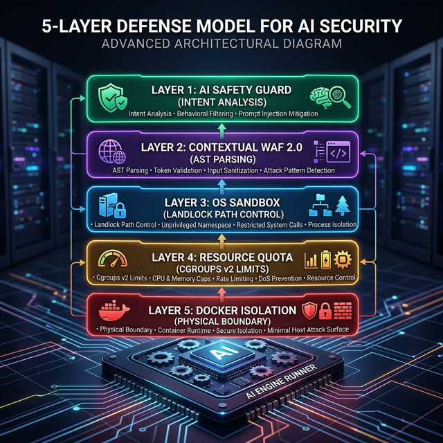
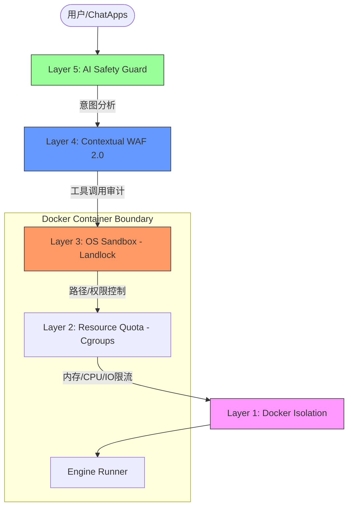

# HotPlex Sandbox + Multi-Bot Architecture (V2 - Risk-Aware & ROI Optimized)

> **Issue**: #202 | **Date**: 2026-03-06 | **Status**: Optimized Plan | **Version**: 2.0

## 1. 方案背景与演进

本方案在 V1 版本基础上，结合 **ROI (投资回报率)** 分析与 **Bot 异常风险行为（Risk Actions）** 防御深度优化。考虑到项目目前**已采用 Docker 沙箱**作为物理隔离基础，本方案重点在于如何在 Docker 内部实现更细粒度的安全控制与资源配额，确保多 Bot 并发运行时的稳定性与可控性。

---

## 2. 核心架构：五层防御模型 (Defense in Depth)

针对 HotPlex 运行在 Docker 容器内的现状，实施分层加固：

### 2.1 架构全景图

### 2.2 分层防御定义

| 层级                     | 技术手段                   | 核心目标                                                | 自动化权重 |
| :----------------------- | :------------------------- | :------------------------------------------------------ | :--------- |
| **L5: AI Safety Guard**  | 轻量级本地 LLM             | 语义级意图识别，检测绕过规则的恶意指令或提示词攻击      | 智能触发   |
| **L4: Contextual WAF**   | AST 解析 + Tool-level 拦截 | 在 `bash_execute` 执行前进行原子指令审计，而非仅 Prompt | 全自动     |
| **L3: OS Sandbox**       | **Landlock LSM**           | 限制容器内进程仅能读写 `WorkDir`，防止容器内路径穿越    | 强力底层   |
| **L2: Resource Quota**   | **Cgroups v2**             | 限制单个 Bot 的内存、CPU、进程数及磁盘 IO，防止 DoS     | 运行保障   |
| **L1: Docker Isolation** | Namespace/Capability       | 利用 Docker 默认隔离，并剥夺不必要的系统权限 (CAP_DROP) | 物理基础   |

---

## 3. Bot 异常风险行为防护策略

针对 AI Bot 产生的“非预期指令”，实施 **智能动态授权 (Smart Dynamic Auth)**：

### 3.1 风险分级分值模型 (Risk Scoring)

根据指令意图评估风险分值，自动权衡“效率”与“安全”：

*   **低风险 (Score < 30)**: 如 `ls`, `grep`, `git status`。
    *   **处理**: **静默全自动执行**，不中断 AI 的思考流水线。
*   **中风险 (Score 30-70)**: 如修改源代码、执行测试、安装小型 npm 依赖。
    *   **处理**: **自动执行 + 异步审计通知**。记录到 Audit Log，并在聊天界面显示执行痕迹。
*   **高风险 (Score > 70)**: 如 `rm -rf`, 修改系统级配置文件, 尝试访问容器外路径。
    *   **处理**: **中断流程请求人工审批 (HITL)**。通过交互式按钮（Approve/Reject）由用户决定。

### 3.2 深度防御：Landlock 与 Docker 联动

在 Docker 容器已经提供的物理隔离基础上，通过 Landlock 进一步收紧：
*   **权限剥夺**: 剥夺 Bot 进程查看 `/etc`, `/proc` 等系统敏感信息的权限。
*   **路径锁定**: 强制指定 Bot 只能在映射的 Workspace 目录下进行文件操作。

---

## 4. ROI 分析矩阵 (Return on Investment)

评估各项安全特性对“自动化流水线”的影响与安全收益：

| 特性                      | 安全收益    | 自动化损害 (用户摩擦) | 实施难度 | ROI 级别 |
| :------------------------ | :---------- | :-------------------- | :------- | :------- |
| **WAF 2.0 (实时审计)**    | 高          | 极低                  | 低       | ⭐⭐⭐⭐⭐    |
| **Cgroups 资源隔离**      | 中 (防崩溃) | 无                    | 低       | ⭐⭐⭐⭐⭐    |
| **Smart HITL (交互审批)** | 高          | 中 (仅高危动作中断)   | 中       | ⭐⭐⭐⭐     |
| **Landlock 内核隔离**     | 极高        | 无                    | 中       | ⭐⭐⭐⭐     |
| **gVisor (重虚拟化)**     | 极高        | 低                    | 极高     | ⭐        |

**结论**: 优先在 Docker 内部落地 **WAF 2.0 + Cgroups + Smart HITL**，可实现 90% 的风险可控且不牺牲自动化效率。

---

## 5. 多租户孤岛化设计 (Bot Multi-Tenancy)

每个 Bot 实例（Workspace）在物理上共享同一个 Docker 镜像，但在逻辑上实现“孤岛化”：

1.  **独立工作目录**: 映射到宿主机的不同子目录。
2.  **受限 Cgroup 组**: 每个 Session 绑定到特定的 Cgroup 节点。
3.  **身份映射**: 统一使用容器内的 `hotplex` 非特权用户运行，配合 Landlock 实现路径级拒绝。

---

## 6. 实施路线图 (Updated Roadmap)

### Phase 1: 风险感知与交互增强 (2周 - 核心 ROI)
- [ ] **WAF 2.0**: 实现对 Bot 产生的中间指令执行前的动态拦截逻辑。
- [ ] **Interactive Approval**: 实现在主流 ChatApps 中的 `permission_request` 交互式按钮。
- [ ] **Resource Limits**: 在 `docker-compose.yml` 中配置标准的资源上限。

### Phase 2: 系统级防御下沉 (3周)
- [ ] **Landlock Integration**: 集成 `golang.org/x/sys/unix` 利用 Linux 内核特性加固文件访问。
- [ ] **Audit Trail**: 补全审计流水，支持针对 Bot 异常行为的回溯分析。

### Phase 3: 语义化安全审计 (4周)
- [ ] **AI Guard**: 集成轻量级安全专用小模型，对复杂提示词注入进行语义识别。

---

## 7. 总结

本方案在肯定 **Docker 作为基础沙箱** 的同时，正视了容器内逃逸及 Bot 逻辑行为失控的风险。通过 **“内核隔离 + 语义审计 + 动态确认”** 的闭环，实现了您要求的“智能且自动，风险可控”的极致平衡。
