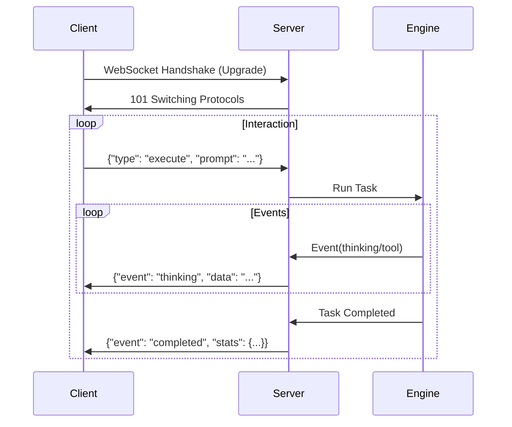

*Read this in other languages: [English](api.md), [简体中文](api_zh.md).*

# HotPlex Server Mode Developer Manual

HotPlex supports a dual-protocol server mode that allows it to act as a production-grade control plane for AI CLI agents. It natively handles standard agent protocols and provides a compatibility layer for the OpenCode ecosystem.

## 1. HotPlex Native Protocol (WebSocket)

The native protocol provides a robust, full-duplex communication channel for real-time interaction with AI agents.

### Protocol Flow


### Authentication
If configured, the server requires an API key passed via header or query parameter:
- **Header**: `X-API-Key: <your-key>`
- **Query**: `?api_key=<your-key>`

### Client Requests (JSON)
Clients send JSON messages to control the engine.

| Field           | Type    | Description                                                |
| :-------------- | :------ | :--------------------------------------------------------- |
| `request_id`    | integer | Optional, used to track request-response pairs             |
| `type`          | string  | `execute`, `stop`, `stats`, or `version`                   |
| `session_id`    | string  | Unique identifier for the session (optional for `execute`) |
| `prompt`        | string  | User input (required for `execute`)                        |
| `instructions`  | string  | Task-specific instructions (priority over system prompt)   |
| `system_prompt` | string  | Session-level system prompt injection                      |
| `work_dir`      | string  | Sandbox working directory                                  |
| `reason`        | string  | Reason for stopping (only for `stop` type)                 |

### Server Events (JSON)
The server broadcasts events in real-time.

| Event                | Description                                                         |
| :------------------- | :------------------------------------------------------------------ |
| `thinking`           | Model reasoning or chain-of-thought process                         |
| `tool_use`           | Agent initiating a tool call (e.g., shell command)                  |
| `tool_result`        | Output/response from the executed tool                              |
| `answer`             | Incremental text response fragments from the agent                  |
| `completed`          | Interaction turn finished (includes `session_id` and summary stats) |
| `session_stats`      | Detailed final statistics (tokens, duration, cost, etc.)            |
| `stopped`            | Task manually stopped by client                                     |
| `error`              | Protocol, model, or engine execution error                          |
| `permission_request` | Agent requesting permission (needs client confirmation)             |
| `plan_mode`          | Agent entering planning mode                                        |
| `exit_plan_mode`     | Agent exiting planning mode                                         |
| `stats`              | Response to `type: "stats"` request                                 |
| `version`            | Response to `type: "version"` request                               |

### Example (Python)
```python
import asyncio
import websockets
import json

async def run_agent():
    uri = "ws://localhost:8080/ws/v1/agent"
    async with websockets.connect(uri) as websocket:
        # Execute prompt
        req = {
            "type": "execute",
            "prompt": "Write a hello world script in Go",
            "system_prompt": "You are a senior Gopher. Be concise.",
            "work_dir": "/tmp/demo"
        }
        await websocket.send(json.dumps(req))

        # Listen for events
        async for message in websocket:
            evt = json.loads(message)
            print(f"[{evt['event']}] {evt.get('data', '')}")
            if evt['event'] == 'completed':
                break

asyncio.run(run_agent())

### Example (Node.js)
```javascript
const WebSocket = require('ws');

const ws = new WebSocket('ws://localhost:8080/ws/v1/agent');

ws.on('open', function open() {
  // Execute prompt
  ws.send(JSON.stringify({
    type: 'execute',
    prompt: 'Write a hello world script in JavaScript',
    system_prompt: 'You are a Node.js expert.',
    work_dir: '/tmp/demo'
  }));
});

ws.on('message', function incoming(message) {
  const evt = JSON.parse(message);
  console.log(`[${evt.event}]`, evt.data || '');
  if (evt.event === 'completed') {
    ws.close();
  }
});
```

### Example (Go)
```go
package main

import (
	"context"
	"encoding/json"
	"fmt"
	"github.com/hrygo/hotplex"
)

func main() {
	engine, _ := hotplex.NewEngine(hotplex.EngineOptions{})
	defer engine.Close()

	cfg := &hotplex.Config{
		WorkDir:   "/tmp/demo",
		SessionID: "ws-demo",
	}

	err := engine.Execute(context.Background(), cfg, "Write a hello world in Go",
		func(eventType string, data any) error {
			if eventType == "answer" {
				fmt.Print(data)
			}
			return nil
		})
	if err != nil {
		fmt.Println("Error:", err)
	}
}
```

---

## 2. OpenCode Compatibility Layer (HTTP/SSE)

HotPlex provides a compatibility layer for OpenCode clients using REST and Server-Sent Events (SSE).

### Endpoints

#### Global Event Stream
`GET /global/event`
Establishes an SSE channel to receive broadcast events.

#### Create Session
`POST /session`
Returns a new session ID.
**Response**: `{"info": {"id": "uuid-...", "projectID": "default", ...}}`

#### Send Prompt
`POST /session/{id}/message` or `POST /session/{id}/prompt_async`
Submits a prompt for execution. Returns `202 Accepted` immediately; outputs flow through the SSE channel.

| Field           | Type   | Description                        |
| :-------------- | :----- | :--------------------------------- |
| `prompt`        | string | The user query                     |
| `system_prompt` | string | System prompt injection (optional) |

**SSE Event Mapping**:
OpenCode SSE messages are formatted as `{"type": "message.part.updated", "properties": {"part": {...}}}`. The `part.type` mappings are:
- `text`: Maps to agent `answer`.
- `reasoning`: Maps to agent `thinking`.
- `tool`: Maps to `tool_use` and `tool_result`.

#### Server Configuration
`GET /config`
Returns server version and capability metadata.

### Security Note
Access control via `HOTPLEX_API_KEYS` environment variable is recommended for production deployments.

## 3. Error Handling & Troubleshooting

| Code                      | Reason                             | Action                                  |
| :------------------------ | :--------------------------------- | :-------------------------------------- |
| `401 Unauthorized`        | Invalid or missing API key         | Check `HOTPLEX_API_KEY` env             |
| `404 Not Found`           | Session ID does not exist          | Create a new session first              |
| `503 Service Unavailable` | Engine overloaded or shutting down | Retry with exponential backoff          |
| `WebSocket Closure 1006`  | Connection dropped (timeout/WAF)   | Check `HOTPLEX_IDLE_TIMEOUT` or network |

### Common Issues
- **Origin Rejected**: If connecting from a browser, ensure the origin is in `HOTPLEX_ALLOWED_ORIGINS`.
- **Tool Timeout**: If a tool takes $>10\text{min}$, the connection might drop. Use `task_boundary` pulses to keep alive.

## 4. Best Practices

### Session Management
- **Persistence**: For long-running tasks, provide a consistent `session_id`. If the connection drops, you can reconnect and the engine will provide context from the existing session.
- **Cleanup**: Always send a `{"type": "stop"}` request if you wish to terminate an agent early and free up server resources.
- **Concurrency**: HotPlex supports multiple concurrent sessions per server instance. Each session is isolated in its own process group (PGID).

### Performance
- **Streaming**: Always use the event stream for real-time UI updates instead of polling.
- **Sandbox**: Keep `work_dir` consistent within a session to allow the agent to manage project state correctly.
