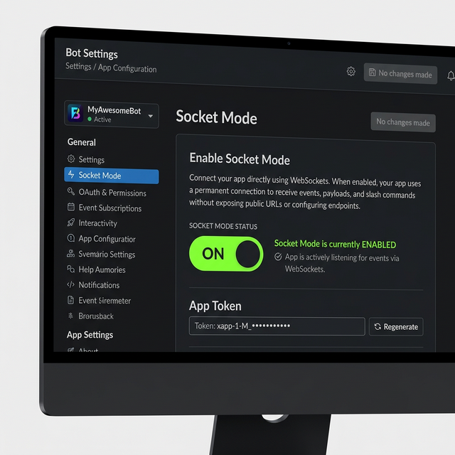

# 👶 Zero to Hero! Beginner's Guide to Connecting Slack App to HotPlex

> 🎯 **This tutorial is specifically designed for users who want to skip complex instructions.**
> Just follow these click-by-click steps and you won't miss any manual configurations!
>
> If you need advanced features, full parameters documentation, granular permission controls, or details of the App Manifest JSON, please refer to:
> 👉 [Slack App Core Configuration Manual](./chatapps/chatapps-slack-manual.md)

---

## 🟢 Core Concept: What are we actually doing?
To connect HotPlex with your Slack App, the underlying logic is composed of just two core steps:
1. We must **register a dedicated bot account** in the Slack API Developer Portal.
2. Then, grab the **API Keys (Tokens)** of this bot and paste them into your HotPlex configuration file.

That's it! Let's get started!

---

## Step 1: One-Click Create Your Slack Bot

We don't need to manually configure the avatar, name, and permissions one by one. We'll use a pre-built magic spell (Manifest).

1. **Login to the Console**: Open your browser and go to [https://api.slack.com/apps](https://api.slack.com/apps).
2. **Click the Green Button**: Click the prominent green button **"Create New App"** at the top right.
3. **Choose App Type**:
   - In the popup modal, **you must choose the second option: "From an app manifest"**.


4. **Select Workspace**: Pick your company/team Workspace from the dropdown (e.g., `BigTechCompany`), then click **"Next"**.
5. **Paste the Magic Spell**:
   - You will see a text box containing some boilerplate code (ensure the "JSON" tab is selected at the top).
   - **Delete everything** inside the text box so it's completely empty.
   - **Go to 👉 [Here (App Manifest section in the Advanced Manual)](./chatapps/chatapps-slack-manual.md#⚡-quick-integration-app-manifest) and copy the entire JSON code block. Paste it exactly as is into your empty box!**
   - Click the **"Next"** button at the bottom.
   - Review the summary, then click **"Create"**.
   - 🎉 **Congratulations on finishing Step 1! The bot account is successfully created in the backend!**

---

## Step 2: Enable the Communication Tunnel (Socket Mode)

To allow a local or intranet HotPlex instance to penetrate firewalls and connect to Slack (without needing a public IP address), we must turn on Socket Mode.

1. **Go to Left Menu**: On your newly created App's settings page, scroll down the left sidebar menu to find and click **"Socket Mode"**.
2. **Toggle the Switch**: Toggle the switch for **"Enable Socket Mode"** to the right side so it shows **"On" (🟢)** status.



3. **Name your Secret**:
   - A modal will immediately pop up asking you to generate an App-Level Token.
   - Type any recognizable name into the `Token Name` box, for example: `hotplex_socket`.
   - Click the green **"Generate"** button.
4. **Copy the First Key (App Token)**:
   - A new screen will show a very long string of characters starting with `xapp-...`.
   - **Click "Copy"** and temporarily paste this into a local notebook on your computer (this is super important, we'll use it soon!).
   - Once copied, click "Done" to close the window.

---

## Step 3: Install the Bot to Your Slack and Grab the Second Key

Right now, the bot only exists in the developer's "greenhouse". We need to officially deploy it to your team's chat space.

1. **Go to Install Page**: Scrolling up the left menu sidebar, click on **"Install App"**.
2. **Click Install Button**: Click the only prominent green button on the page: **"Install to Workspace"**.
3. **Authorize**: A page will load asking if you allow "HotPlex" to access your workspace data and send messages. Click the green **"Allow"** button to grant permission.
4. **Copy the Second Key (Bot Token)**:
   - After successful authorization, you'll be redirected back to the settings page. You will see a section named **"Bot User OAuth Token"**.
   - This long secret starts with `xoxb-...`.


   - **Click "Copy"** and also paste this string into your local notebook.

---

## Step 4: Tell HotPlex the Secret Handshakes (.env Configuration)

You should now have two secret character strings in your notebook:
- One string starting with `xapp-` (App Token for the Socket Mode).
- One string starting with `xoxb-` (Bot Token representing the bot's identity).

Next, we inject them into the HotPlex service:

1. **Find the Config file**: Open the root directory of your HotPlex server code. Locate the file named `.env`.
   *(Note: If you can't find it, copy the `.env.example` file located nearby and rename that copy to exactly `.env`.)*
2. **Fill in the Tokens**: Open the `.env` file using a text editor (like VSCode or Notepad), and paste your passwords following this format:

```env
# Firstly ensure your communication mode is socket
HOTPLEX_SLACK_MODE=socket

# Fill in your [Second Key] which MUST start with xoxb-
HOTPLEX_SLACK_BOT_TOKEN=xoxb-paste_your_copied_secret_here

# Fill in your [First Key] which MUST start with xapp-
HOTPLEX_SLACK_APP_TOKEN=xapp-paste_your_copied_secret_here
```

3. **Save the file** (Crucial step!).

---

## Step 5: Start HotPlex & Start Chatting!

1. **Start the Engine**: In the terminal/console where your HotPlex server lives, execute your startup command (e.g., `make restart` or your specific launch command). Assuming the console isn't spitting out red error text, the connection is established!
2. **Test it inside Slack**:
   - Open your company's Slack application or web interface.
   - Go to any existing channel or create a test channel.
   - **Critical Action**: Send `@HotPlex` in the chat box. Because the newborn bot isn't in your channel yet, Slack will prompt to ask if you want to invite them. Click **Invite them**.
   - Now, you can type commands: press the slash key `/` on your keyboard. If you see autocomplete suggestions pop up like `/reset` or `/dc`... Congratulations, everything is working perfectly!
   - Try sending a simple "Hi" to the bot in the channel or via its DM space to kickstart your AI-powered productivity journey!

> 💡 **Want to level up?**
> Once you graduate from the beginner village, you might discover you need finer controls: Like how to restrict a specific user from chatting? How to prevent AI from using dangerous tools (like deleting source code)? How to deploy the shiny new 2026 Admin Dashboard?
> When you're ready, consult the engineering bible 👉 [Slack App Core Configuration Manual](./chatapps/chatapps-slack-manual.md).
